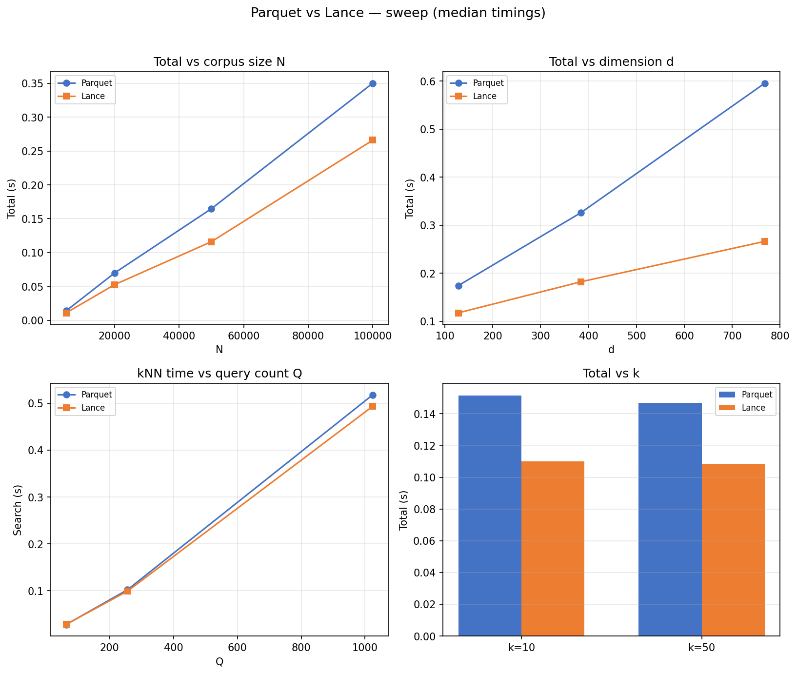
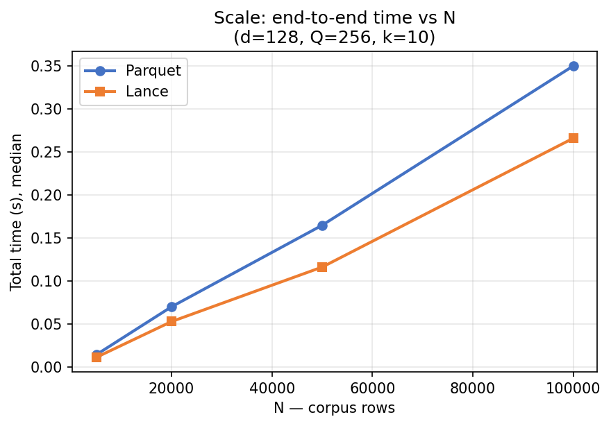
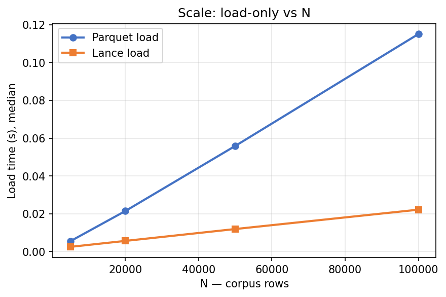
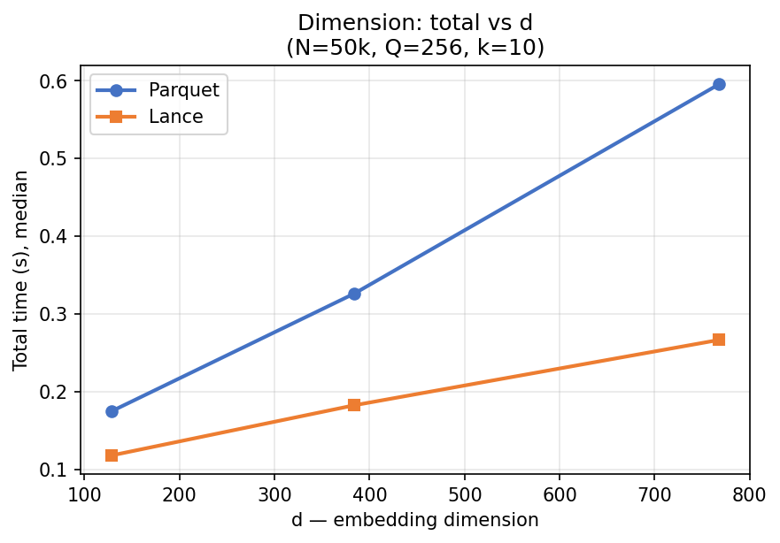
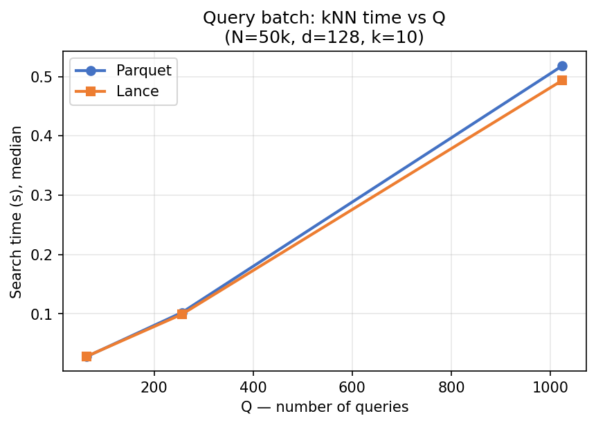
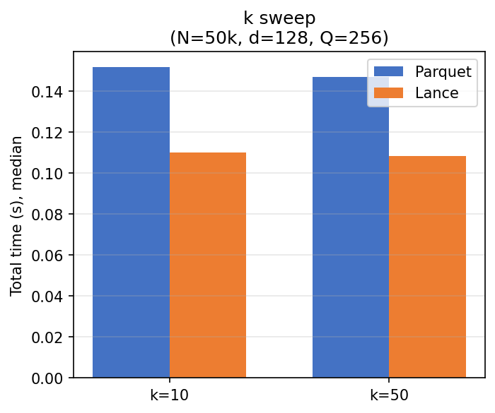

# Benchmark visualizations

Charts are generated from **`results/sweep.json`** (median timings per scenario × backend) using **matplotlib**. They answer “how do Parquet and Lance compare as we change **N, d, Q, k**?” for this harness (full materialization + shared brute-force kNN).

---

## How to generate

```bash
# After a sweep (or anytime you have sweep JSON):
.venv/bin/lance-bench plot --from results/sweep.json --out-dir results/plots

# In one step:
.venv/bin/lance-bench sweep --plot-to results/plots
```

**Outputs** (under `results/plots/` by default):

| File | What it shows |
| ---- | ------------- |
| `sweep_dashboard.png` | **2×2** summary: total vs **N**, total vs **d**, search vs **Q**, total vs **k** |
| `scale_total.png` | End-to-end **total** time vs corpus size **N** |
| `scale_load.png` | **Load-only** time vs **N** |
| `dimension_total.png` | **Total** time vs embedding dimension **d** |
| `queries_search.png` | **kNN (search)** time vs query batch size **Q** |
| `k_total.png` | **Total** time for different **k** (grouped bars) |
| `scale_disk_mib.png` | **On-disk** size (MiB) vs **N** — Parquet file vs Lance directory |
| `dimension_disk_mib.png` | **On-disk** size (MiB) vs **d** (N=50k dimension sweep) |
| `scale_rss_mib.png` | **Peak RSS** during **load** and **search** vs **N** (needs `--profile`, default on) |
| `dimension_rss_mib.png` | **Peak RSS** during **load** and **search** vs **d** |
| `resources_dashboard.png` | **2×2**: disk vs N, disk vs d, RSS **load** peak vs N, RSS **load** peak vs d |

If the sweep was run with **`--no-profile`**, RSS plots are skipped (or panels show a hint); disk plots still appear when `storage_bytes` is in the JSON.

**Legend:** Blue = Parquet, orange = Lance (same as matplotlib defaults in code).

**Units:** **MiB** = 1024² bytes (same as the Markdown report tables).

---

## Checked-in snapshot

For the repo (without relying on gitignored `results/`), the same PNGs from the last local sweep are copied to [reports/figures/](reports/figures/).

### Dashboard (2×2)



### Scale — total vs N



### Scale — load vs N



### Dimension — total vs d



### Queries — search vs Q



### k — total time



---

## How to read the graphs

- **Total** = median **load** + **search** for that scenario (see [Sweep and report](sweep-and-report.md)).
- **Search** lines should rise roughly linearly with **Q** (more queries → more distance work). They should be **close** between backends (same NumPy kernel).
- **Load** and **total** can **favor either** backend depending on machine, cache, and library versions — use the graphs for **shape** (scaling) and **rough gap**, not universal ranking.
- **Disk** curves compare **file size** (Parquet, compressed columnar) vs **sum of Lance files** (different layout; Lance often larger for small corpora due to metadata/overhead).
- **RSS** curves are **sampled peaks** in one process; see [Disk and memory profiling](disk-and-memory.md) before drawing strong conclusions.

---

## See also

- [Sweep and report](sweep-and-report.md)
- [reports/benchmark-report.md](reports/benchmark-report.md)
